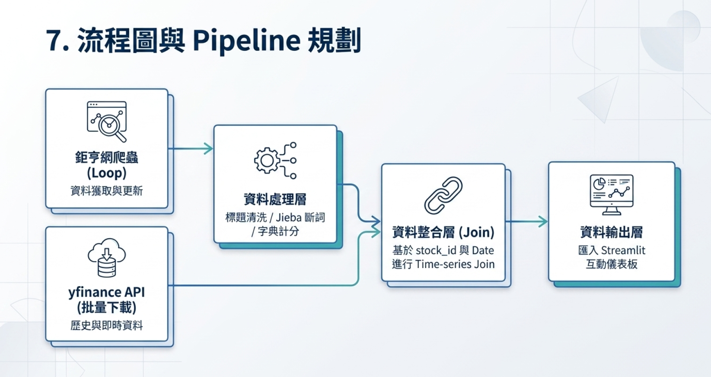

# 股票市場情緒分析系統 (FinMood)

---

## 💡 製作動機 (Motivation)

在目前資訊爆炸的時代，金融新聞與市場評論無孔不入，散戶投資人常被迫接收混亂且經過包裝的市場噪音（例如，部分「利多新聞」實際上是主力出貨的前置訊號）。然而，現有的量化交易工具與財經資訊平台大多僅專注於提供歷史 K 線或財務指標，散戶**缺乏一套能科學量化新聞輿情、並直觀辨識新聞真偽與時效性的工具**。

身為在職專班的期末專題，我們希望建立一套結合 NLP（自然語言處理）與 Financial Analytics 的輿情對齊分析模型，破除「媒體造神」或「盲目恐慌」，用數據為散戶搭建一道理性的防呆決策屏障。

---

## 📈 核心業務問題 (Business Questions)

本專案主要探討並解決以下 3 個核心業務問題：
1. **領先或滯後？** 當爆發多/空新聞大潮時，股價是「即時反應」、「提前反映」還是新聞只是股價走勢後塵的「落後出貨文」？
2. **極端情緒的分水嶺在哪？** 市場情緒分數 (Sentiment Score) 要達到什麼閾值（如 PR90/PR10），或是當日的輿情密度 (News Density) 達到什麼等級，其對應的股價反轉或延續的期望值最高？
3. **資訊落差的套利空間？** 散戶能否以此系統生成的「冷靜警報（市場極度看多時的反向訊號）」與「撿便宜訊號（極度看空時的買進訊號）」，在扣除交易成本後獲得相較於大盤更高的操作勝率？

---

## 🎯 專案價值：散戶如何使用這套系統？

散戶在股市中最常遇到的痛點是：**「上班沒空看盤，下班看新聞卻不知道該不該相信，常常變成最後一隻老鼠。」**

這套系統就是散戶的**「新聞測謊機」**與**「防呆警報器」**。

### 實際使用情境 (User Story)

1. **情境一：避開「主力出貨文」的陷阱**
   - **問題**：散戶下班滑手機，看到滿天飛的「台積電營收創新高、外資狂喊加碼」新聞，忍不住隔天開盤衝進去買，結果買在最高點。
   - **系統如何解決**：散戶打開我們的系統一看，發現台積電的「新聞情緒分數」飆到極度樂觀 (0.9 分)，但對照股價 K 線圖，發現**「股價早就已經連漲 3 天了」**。系統會標示這極可能是「落後指標 / 出貨文」，提醒散戶控制風險，不要追高。

2. **情境二：克服恐慌，勇敢撿便宜 (逆勢指標)**
   - **問題**：大盤暴跌，財經節目都在喊「台股會跌破萬點」，散戶恐慌性停損，砍在阿呆谷。
   - **系統如何解決**：散戶查看系統，發現市場情緒分數跌到史無前例的 -0.9 (極度恐慌)。系統根據歷史回測數據告訴他：「過去發生極度恐慌時，未來一週反彈機率高達 80%」。散戶有了客觀數據支撐，就能克服人性弱點，甚至開始分批建倉撿便宜。

3. **情境三：上班不用盯盤，靠 LINE 自動防護 (規劃中)**
   - **問題**：上班族無法時時刻刻盯著新聞和股價。
   - **系統如何解決**：散戶訂閱了 2330 台積電。當系統爬蟲發現 1 小時內突然湧入大量負面新聞（情緒急殺）時，立刻透過 LINE Notify 推播：「⚠️ 台積電突現暴增負面輿情，請留意持股波動」，讓散戶能第一時間止盈止損。

---

## 🌟 本專案三大亮點 (Highlights)

1. **把「感覺」變成「數據」**：用 NLP 技術 (Jieba + NTUSD) 量化新聞，將主觀的文字變成客觀的 `[-1.0, 1.0]` 分數，排除人為偏見。
2. **驗證新聞的「滯後效應」**：結合真實股價，一眼看出新聞發布與股價漲跌的時差，破解媒體造神或恐慌的假象。
3. **從分析走向「決策」**：不只是數據視覺化，更能基於極端分數提供「順勢」或「逆勢」的交易警示，帶來真實的商業/投資價值。

---

## 系統架構


```
Source → Ingest → Storage → Process → Serve → Observe
```

把上面每個階段換成你們實際用的工具，例如：

| 階段 | 工具 |
|---|---|
| Source | {例：Spotify API / Kaggle CSV / 公開資料} |
| Ingest | Python |
| Storage | MySQL / MongoDB |
| Process | pandas / SQL |
| Serve | FastAPI / Streamlit |
| Observe | LINE Notify / Sentry |

---

## 環境需求

- **Python ≥ 3.12**（專案透過 `.python-version` 鎖定為 3.12）
- **[uv](https://docs.astral.sh/uv/)** — 快速的 Python 套件 / 專案管理工具

> [!IMPORTANT]
> 本專案以 `uv` 管理依賴（`pyproject.toml`），不使用傳統 `requirements.txt`。
> 若尚未安裝 uv，請先執行：
> ```bash
> # Windows (PowerShell)
> powershell -ExecutionPolicy ByPass -c "irm https://astral.sh/uv/install.ps1 | iex"
>
> # macOS / Linux
> curl -LsSf https://astral.sh/uv/install.sh | sh
> ```

---

## 快速開始

```bash
git clone https://github.com/FinMood/Stock-Market-Sentiment-Analysis-System.git
cd Stock-Market-Sentiment-Analysis-System
cp .env.example .env   # 填入需要的 API keys
uv sync                # 自動建立 venv 並安裝所有依賴
uv run python main.py  # 透過 uv 執行（自動使用正確的 venv）
```

---

## 團隊
分工
Table 1 —> Table 3 : 2-3位(包含斷詞等處理)
Table 3+ Table 2 —> Table 4  ： 2-3位  (包含建立API)

| 成員 | 負責範圍 | GitHub |
|---|---|---|
| 王翠賢 | {標題清洗/Jieba斷詞/字典計分} | [翠賢github](https://github.com/Cuei-Sian) |
| 張凱宇 | {爬蟲} | [凱宇github](https://github.com/HolaBaGa) |
| 廖宏偉 | {資料整合} | [宏偉github](https://github.com/Json105) |
| {Name} | {負責什麼} | @user3 |

---

## 進度追蹤

見 [task.md](task.md)

---

## License

MIT
